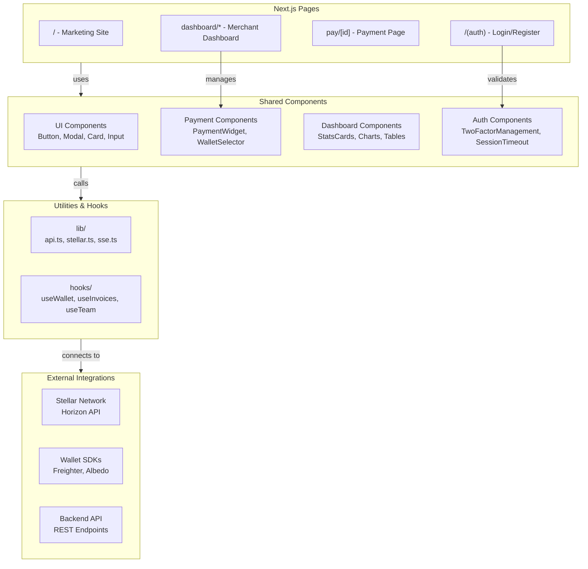

# Stargate Frontend

Next.js marketing site, merchant dashboard, public payment pages, wallet integration, webhook settings, and embeddable widget.

The frontend follows the Stargate design prompt kit: dark fintech hero, B2B navigation, transactions, payment links, wallets, webhooks, team controls, developer docs, hosted checkout, and the widget SDK.

## Local Development

```sh
cp .env.local.example .env.local
npm install
npm run dev
```

## Local Wallet Testing

The payment flow supports [Freighter](https://freighter.app) and [Albedo](https://albedo.link) wallets. To test wallet connection locally:

### Freighter (recommended)

1. Install the [Freighter browser extension](https://freighter.app).
2. Open Freighter, create or import a wallet, and switch the network to **Testnet** (Settings → Network → Testnet).
3. Fund your testnet account using [Stellar Friendbot](https://friendbot.stellar.org/?addr=YOUR_PUBLIC_KEY) or the [Stellar Laboratory](https://laboratory.stellar.org/#account-creator?network=test).
4. To receive USDC on testnet, add a trustline for the testnet USDC asset:
   - Asset code: `USDC`
   - Issuer: `GBBD47IF6LWK7P7MDEVSCWR7DPUWV3NY3DTQEVFL4NAT4AQH3ZLLFLA5`
5. Start the dev server (`npm run dev`) and open a payment page (`/pay/<invoice-id>`).
6. Click **Connect Freighter** — the extension will prompt for access and then sign the payment transaction.

### Albedo

Albedo works in-browser without an extension. Select **Albedo** on the wallet selector and follow the popup prompts. Use the same testnet USDC issuer above when adding a trustline.

### Testnet tips

- Testnet accounts reset periodically; re-fund with Friendbot if your balance disappears.
- Set `NEXT_PUBLIC_STELLAR_NETWORK=testnet` in `.env.local` to ensure transactions are submitted to the test network.
- Use the [Stellar Expert testnet explorer](https://stellar.expert/explorer/testnet) to inspect transactions.

## Architecture



## Verification

```sh
npm run typecheck
npm run lint
npm test
npm run build
npm run build:widget
```

The from-scratch product prompt kit lives at `../docs/stargate-product-build-prompts.md`.

## Production

```sh
cp .env.production.example .env.production
npm run build
npm run build:widget
```

`vercel.json` contains the production build command, global security headers, hosted-checkout frame policy, and widget rewrite used by the deployment workflow.

### GitHub Secrets (Required for Vercel Deployment)

The following GitHub secrets must be configured on the `dreamgeneX/stargate-frontend` repository for production deployments to work:

| Secret | Type | Description |
| :--- | :--- | :--- |
| `VERCEL_TOKEN` | `string` | Authentication token for Vercel API. Generate from [Vercel Account Settings](https://vercel.com/account/tokens). |
| `VERCEL_ORG_ID` | `string` | Organization ID from Vercel. Found in Vercel dashboard under Settings → General. |
| `VERCEL_PROJECT_ID` | `string` | Project ID from Vercel. Found in Vercel dashboard under Settings → General. |

**How to set GitHub secrets:**
1. Go to repository Settings → Secrets and variables → Actions
2. Click "New repository secret"
3. Enter the secret name and value
4. Click "Add secret"

### GitHub Repository Variables (Required for Environment Configuration)

The following GitHub repository variables must be configured for production environment setup:

| Variable | Type | Default | Description |
| :--- | :--- | :--- | :--- |
| `NEXT_PUBLIC_APP_URL` | `string` | `http://localhost:3000` | Public-facing domain URL of the frontend console. Used to generate webhook endpoints, copyable integration scripts, and SDK configuration details. Example: `https://app.stargate.example.com` |
| `NEXT_PUBLIC_API_URL` | `string` | `http://localhost:3001` | Base API URL for frontend interactions. Used for general API calls and payment confirmation streams. Example: `https://api.stargate.example.com` |

**How to set GitHub repository variables:**
1. Go to repository Settings → Secrets and variables → Variables
2. Click "New repository variable"
3. Enter the variable name and value
4. Click "Add variable"

### Deployment Workflow

The production deployment workflow (`.github/workflows/deploy-production.yml`) uses these secrets and variables to:
1. Authenticate with Vercel using `VERCEL_TOKEN`
2. Deploy to the correct Vercel organization and project using `VERCEL_ORG_ID` and `VERCEL_PROJECT_ID`
3. Configure environment variables for the deployed application using `NEXT_PUBLIC_APP_URL` and `NEXT_PUBLIC_API_URL`

### Environment Variables for Production Build

When deploying to production, ensure the following environment variables are set:

```bash
# Required
NEXT_PUBLIC_APP_URL=https://app.stargate.example.com
NEXT_PUBLIC_API_URL=https://api.stargate.example.com
NEXT_PUBLIC_STELLAR_NETWORK=mainnet  # Use 'mainnet' for production

# Optional (defaults provided)
# NEXT_PUBLIC_STELLAR_NETWORK defaults to 'testnet' if not set
```

### Verification Before Deployment

Before deploying to production, verify:

1. All GitHub secrets are configured correctly
2. All GitHub repository variables are set
3. Environment variables are correct for your production environment
4. Run the verification commands:
   ```bash
   npm run typecheck
   npm run lint
   npm run build
   npm run build:widget
   ```

### Troubleshooting Deployment Issues

**Issue: "Vercel authentication failed"**
- Verify `VERCEL_TOKEN` is valid and not expired
- Regenerate the token from Vercel Account Settings if needed

**Issue: "Project not found"**
- Verify `VERCEL_ORG_ID` and `VERCEL_PROJECT_ID` are correct
- Ensure the project exists in the specified Vercel organization

**Issue: "Environment variables not set"**
- Verify `NEXT_PUBLIC_APP_URL` and `NEXT_PUBLIC_API_URL` are configured as GitHub repository variables
- Check that the deployment workflow has access to these variables

## Environment Variables

The frontend application is configured via the following environment variables:

| Variable | Type | Default | Usage / Description |
| :--- | :--- | :--- | :--- |
| `NEXT_PUBLIC_API_URL` | `string` (URL) | `http://localhost:3001` | Base API URL for frontend interactions. Used in [api.ts](file:///Users/admin/.pg/stellar-W5/stargate-frontend/lib/api.ts) for general API calls and [sse.ts](file:///Users/admin/.pg/stellar-W5/stargate-frontend/lib/sse.ts) to establish payment confirmation streams. |
| `NEXT_PUBLIC_APP_URL` | `string` (URL) | `http://localhost:3000` | The public-facing domain URL of the frontend console. Used in [developers/page.tsx](file:///Users/admin/.pg/stellar-W5/stargate-frontend/app/dashboard/developers/page.tsx) to generate webhook endpoints, copyable integration scripts, and SDK configuration details. |
| `NEXT_PUBLIC_STELLAR_NETWORK` | `'testnet' \| 'mainnet'` | `testnet` | Specifies the default target Stellar network environment. Used in transaction signing configurations, Horizon endpoints construction, and fallback parameters. |

> **Note**: Never put secrets or private keys in these variables. All variables prefixed with `NEXT_PUBLIC_` are bundled into the client-side code and exposed to the browser.

## Documentation & Customisation Guides

For detailed integration and styling guides, refer to the following documentation:

- [Widget SDK & Event Schema](docs/widget-sdk.md) — Event schemas (`STARGATE_LOADED`, `STARGATE_PAID`, `STARGATE_ERROR`), `postMessage` details, and embedding code.
- [Theming & Branding Customisation Guide](docs/theming-and-branding.md) — Complete walkthrough on how to override CSS variables, customize brand colors, support dark mode, and customize fonts for the hosted checkout page.
- [i18n Contribution Guide](docs/i18n-contribution-guide.md) — Process for adding new languages to the hosted checkout page using next-intl.
- [Performance Budget](docs/performance-budget.md) — Core Web Vitals targets (LCP, CLS, INP) and how they are measured in CI.

## License

MIT

